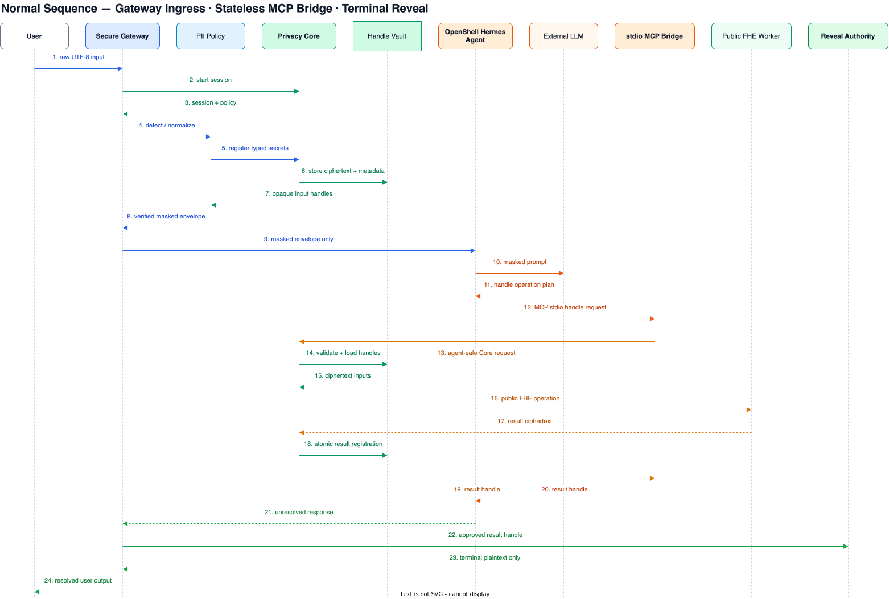

# FHE-Privacy — RAG 없는 전체 아키텍처 흐름

전체 보안 결정 인덱스: [`1-0. security-architecture-index.md`](1-0.%20security-architecture-index.md)

## 핵심 불변식

- Secure Gateway만 사용자 원문을 수신한다.
- Hermes Agent 전체와 Agent MCP Bridge는 OpenShell sandbox 안에서 실행한다.
- Agent/LLM에는 masked envelope와 opaque handle만 전달한다.
- Session-scoped Privacy Core만 handle/ciphertext 상태를 소유한다.
- Agent MCP Bridge는 stateless이며 secret key, Vault와 plaintext를 보유하지 않는다.
- Agent-safe, host-only, reveal channel을 분리한다.
- Plaintext는 승인된 terminal local-egress sink에서만 생성한다.
- 실패하거나 불확실하면 전송, 연산 또는 reveal을 중단한다.

## 전체 컴포넌트 흐름

draw.io 원본: [`1. architecture-component-flow.drawio`](1.%20architecture-component-flow.drawio)

상세 결정:

- [`1-1. pre-llm-ingress.md`](1-1.%20pre-llm-ingress.md)
- [`1-2. mcp-privacy-core-boundary.md`](1-2.%20mcp-privacy-core-boundary.md)
- [`1-3. authority-channel-separation.md`](1-3.%20authority-channel-separation.md)
- [`1-4. handle-vault-contract.md`](1-4.%20handle-vault-contract.md)
- [`1-5. post-llm-reveal-egress.md`](1-5.%20post-llm-reveal-egress.md)

## 단계별 데이터 상태

| 단계 | 위치 | 입력 | 출력 | 평문 접근 |
|---|---|---|---|---|
| 1 | User → Gateway | UTF-8 원문 | raw message | User, Gateway ingress |
| 2 | PII/Crypto ingress | 원문 | typed secret records | trusted host ingress |
| 3 | Session Vault | ciphertext/AEAD secret + metadata | opaque input handle | 평문 없음 |
| 4 | Gateway → OpenShell Hermes Agent | masked envelope | masked conversation | 평문 없음 |
| 5 | Agent → LLM | masked prompt | tool plan/response | 평문 없음 |
| 6 | Agent → MCP Bridge | handle operation | Core request | 평문 없음 |
| 7 | Public Compute | handle-bound ciphertext | stored result ciphertext | 평문 없음 |
| 8 | Core → Agent | result handle | unresolved response | 평문 없음 |
| 9 | Agent → Gateway egress | response + result handle | reveal request candidate | 평문 없음 |
| 10 | Reveal Authority → terminal sink | 승인된 ciphertext | plaintext | 승인된 local sink만 |

## 정상 sequence

draw.io 원본: [`architecture-normal-sequence.drawio`](architecture-normal-sequence.drawio)

정상 흐름:

1. Gateway가 Core session을 시작한다.
2. 사용자의 raw text를 검출·마스킹하고 secret을 Vault에 저장한다.
3. masked envelope만 OpenShell Hermes Agent에 전달한다.
4. LLM이 opaque handle을 이용한 공개 연산을 계획한다.
5. Agent가 stdio MCP Bridge에 handle operation을 요청한다.
6. Core가 session/type/context/provenance를 검증하고 결과 handle을 만든다.
7. Agent가 unresolved result handle을 포함한 응답을 Gateway에 반환한다.
8. Gateway egress와 Reveal Policy가 허용한 결과만 Reveal Authority가 복호한다.
9. Plaintext는 User terminal sink로만 전달된다.

## Interface 경계

| Interface | 호출자 | 허용 기능 |
|---|---|---|
| Gateway host-only Core interface | Secure Gateway | session, masking, encryption, Vault registration |
| Agent-safe Core interface | MCP Bridge | handle 기반 공개 FHE operation |
| Reveal-policy channel | Gateway egress | 승인된 result handle의 local reveal |

`role` argument나 하나의 공용 MCP tool registry로 이 권한을 구분하지 않는다. Agent-facing MCP에는
mask, encrypt, decrypt, resolve, key export와 Vault access tool을 등록하지 않는다.

## 실패/거부 경로

| 상황 | 처리 |
|---|---|
| PII ambiguity/detector/암호화/Vault 실패 | Agent 호출 없음 |
| OpenShell 격리 실패 | secure-gateway 시작 거부 |
| Core 연결 또는 session 실패 | MCP 오류, fallback 없음 |
| raw plaintext/ciphertext operation 인자 | 거부 |
| unknown/cross-session/context mismatch handle | 거부 |
| 입력 secret 직접 reveal | 거부 |
| Agent/LLM/tool로 plaintext 반환 | 거부 |
| unsupported attachment/memory/tool plaintext | secure mode에서 거부 |
| quota/depth/timeout 초과 | 거부 |

## 보안 주장 범위

- 지원되는 secure-gateway 입력의 등록된 secret을 Agent/LLM에 평문으로 보내지 않는다.
- Agent process가 key/Vault/reveal channel에 접근하지 못하도록 OpenShell과 channel 분리를 사용한다.
- FHE public computation은 secret key 없이 수행한다.
- 보안 주장은 OS/kernel 완전 침해, 화면 캡처, 키로거 또는 모든 PII의 완전한 자동 검출을 포함하지 않는다.
- Marker type, 횟수, message length, operation pattern과 주변 문맥의 metadata leakage는 남는다.
