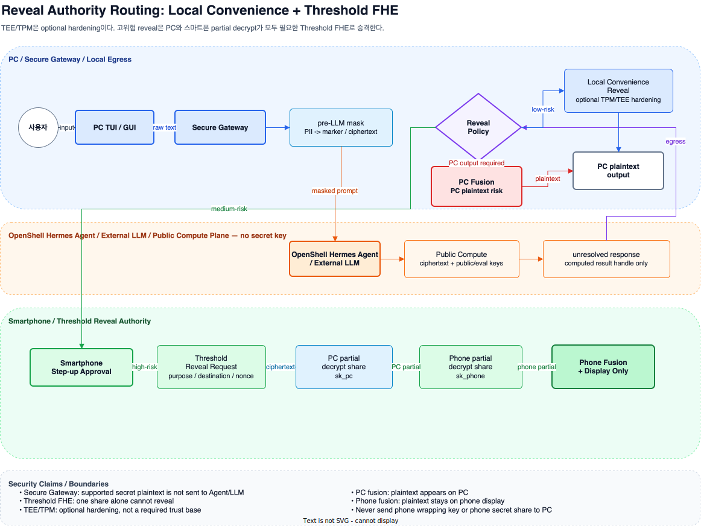

# Reveal Authority Policy

## 1. 설계 관점

- 목적:
  - 외부 LLM / Agent / tool / provider의 평문 민감값 접근 차단
  - plaintext 생성 권한과 일반 Agent 실행 경로 분리
  - reveal 위험도 기반 PC / 스마트폰 / threshold FHE 라우팅

- 기본 관점:
  - PC: 기본 UX 장치, 완전 신뢰 장치 아님
  - 스마트폰: 기본 대화 장치 아님, 고위험 reveal 승인/표시 장치
  - TEE / TPM: 필수 신뢰 기반 아님, key/share 저장 보호 hardening 옵션
  - Threshold FHE: 고위험 reveal에서 단일 장치 단독 plaintext 생성 방지

## 2. 전체 동작 흐름

| 단계 | 위치 | 동작 |
|---|---|---|
| 1. 사용자 입력 | PC | Gateway-owned trusted ingress 입력 |
| 2. 사전 마스킹 | Secure Gateway | 민감값을 marker, vault reference, ciphertext handle로 변환 |
| 3. 외부 처리 | OpenShell Hermes Agent / LLM | masked text와 opaque handle만 처리 |
| 4. 응답 수신 | Secure Gateway | reveal marker 또는 ciphertext handle 검사 |
| 5. Reveal 라우팅 | Reveal Policy | 위험도, 목적지, 세션 상태 기반 reveal 경로 선택 |
| 6. Reveal 수행 | 선택된 reveal authority | PC local reveal, smartphone approval, threshold PC fusion, threshold phone fusion 중 하나 |
| 7. 결과 표시 | PC 또는 스마트폰 | 선택된 출력 위치에만 plaintext 생성 |

- 흐름의 핵심:
  - LLM-facing 경로: 평문 민감값 없음
  - reveal 경로: 일반 LLM tool 호출 아님, local-egress 정책 경로
  - plaintext 위치: reveal 모델과 fusion 위치에 의해 결정

## 3. 구성요소 역할

| 구성요소 | 역할 | 신뢰 관점 |
|---|---|---|
| PC UI / Gateway ingress | 사용자 입력과 결과 표시의 기본 UX | 조건부 신뢰 |
| Secure Gateway | pre-LLM mask, post-LLM local-egress reveal 검사 | 신뢰 경로 |
| OpenShell Hermes Agent / LLM | masked text 처리와 응답 생성 | 비신뢰 |
| Agent MCP Bridge | handle-only stdio 요청 중계 | 비신뢰 sandbox 내부 |
| Privacy Core / Vault | session, handle, ciphertext 상태 소유 | 신뢰 경로 |
| Public Compute Plane | ciphertext와 public/eval key 기반 동형 연산 | 무비밀·confidentiality-untrusted; 결과 무결성 별도 검증 |
| Reveal Policy | reveal 허용, 거부, 승격 결정 | 신뢰 경로 |
| Local Reveal Authority | 낮은 위험도 reveal의 PC 처리 | 낮은 위험도 신뢰 경로 |
| Smartphone Approval | 별도 장치 기반 reveal 요청 확인/승인 | 중간 위험도 신뢰 경로 |
| Threshold Reveal Authority | PC와 스마트폰의 partial decrypt 참여 | 고위험 신뢰 경로 |
| TEE / TPM / Secure Enclave / StrongBox | key 또는 secret share 저장 중 보호 강화 | 선택적 hardening |

## 4. Reveal 모델

| 모델 | 쓰임 | plaintext 위치 |
|---|---|---|
| Local Convenience Reveal | 낮은 위험도 값, 빠른 PC 중심 UX | PC |
| Smartphone Step-up Approval | 별도 장치 확인이 필요한 중간 위험도 reveal | PC |
| Threshold PC Fusion | PC 출력이 필요한 고위험 reveal | PC |
| Threshold Phone Fusion | PC에 plaintext를 남기면 안 되는 고보증 reveal | 스마트폰 |

- Local Convenience Reveal:
  - PC 내부 reveal 완료
  - 높은 사용성
  - PC compromise에 취약

- Smartphone Step-up Approval:
  - 스마트폰의 승인 장치 역할
  - 승인 후 PC plaintext 생성 가능
  - PC 단일키 탈취에 대한 암호학적 방어 아님

- Threshold PC Fusion:
  - PC와 스마트폰의 partial decrypt share 생성
  - PC에서 fusion
  - 결과 plaintext의 PC 생성
  - PC 출력이 필요한 고위험 작업용

- Threshold Phone Fusion:
  - PC partial decrypt share의 스마트폰 이동
  - 스마트폰에서 fusion
  - 스마트폰 화면에만 plaintext 표시
  - 인증코드, 비밀번호, API key 등 PC 반환이 부적절한 값에 적합

## 5. Threshold FHE 개념

- 키 구조:
  - PC: `sk_pc` secret share
  - 스마트폰: `sk_phone` secret share
  - 공개 material: joint public key, joint evaluation key

- 암호화와 연산:
  - joint public key 기반 암호화
  - ciphertext와 evaluation key만 사용하는 외부 계산 영역
  - 외부 계산 영역의 secret share / plaintext 부재

- reveal:
  - PC partial decrypt share 생성
  - 사용자 승인 후 phone partial decrypt share 생성
  - 두 partial decrypt share의 fusion 이후 plaintext 복원

- 중요한 경계:
  - 스마트폰 secret share / wrapping key의 PC 전송 금지
  - 한쪽 secret share만으로 plaintext 복원 불가
  - PC fusion: 최종 plaintext의 PC 생성
  - Phone fusion: 최종 plaintext의 스마트폰 단독 생성

## 6. Reveal 라우팅

| 상황 | 기본 경로 | 이유 |
|---|---|---|
| 낮은 위험도 값 | Local Convenience Reveal | PC 중심 UX 유지 |
| 별도 확인이 필요한 값 | Smartphone Step-up Approval | 별도 장치 기반 요청 확인 |
| PC 출력이 필요한 고위험 값 | Threshold PC Fusion | PC 단독 reveal 방지와 PC 결과 사용 병행 |
| PC에 plaintext를 남기면 안 되는 값 | Threshold Phone Fusion | 최종 plaintext의 스마트폰 단독 표시 |
| 외부 LLM/tool로 평문 반환 | Deny | LLM plaintext zero 원칙과 충돌 |

- 라우팅 기준:
  - 데이터 민감도
  - plaintext 목적지
  - 사용자 확인 필요성
  - PC 신뢰 수준
  - reveal 요청의 과도함 또는 우회 성격

## 7. 신뢰 경계

- 신뢰 경로:
  - `SecureGateway` pre-LLM masking 경로
  - `SecureGateway` local-egress reveal 검사 경로
  - `Reveal Policy`
  - 선택된 reveal authority

- 조건부 신뢰 영역:
  - PC OS, 터미널, GUI, IME
  - PC 앱 메모리
  - 스마트폰 OS와 앱 프로세스
  - TEE/TPM 기반 key wrapping 경로

- 비신뢰 영역:
  - 외부 Agent
  - 외부 LLM
  - 외부 tool/provider
  - Gateway를 우회한 MCP client
  - public compute plane

- 보안 주장 범위:
  - secure gateway 모드: 외부 LLM/Agent/provider로 평문 민감값 미전송
  - threshold FHE 모드: PC 또는 스마트폰 한쪽 secret share만으로 reveal 불가
  - PC fusion: 최종 plaintext의 PC 생성
  - phone fusion: 최종 plaintext의 PC 반환 없음

## 8. MCP / Gateway 경계

- Secure Gateway 모드:
  - LLM 호출 전 gateway 입력 마스킹
  - OpenShell Hermes Agent의 handle-only stdio MCP Bridge
  - session-scoped Privacy Core와 분리된 agent-safe channel
  - LLM 응답 이후 local-egress 정책 경로에서만 reveal 수행
  - FHE-Privacy의 기본 보안 주장 기준

- Gateway를 우회한 MCP-only 연결:
  - 초기 제품 모드로 지원하지 않음
  - LLM의 사용자 원문 선노출 가능성
  - Agent key/Vault 격리와 LLM plaintext zero 주장 불가

- reveal 경계:
  - decrypt / unmask / reveal resolve를 Agent MCP tool로 등록하지 않음
  - 정책 허용 PC 또는 스마트폰 출력 위치에만 reveal 결과 생성

## 9. 참고 링크

- Threshold FHE Reveal 설계 노트: [threshold-fhe-reveal.md](threshold-fhe-reveal.md)
- Android Keystore: <https://developer.android.com/privacy-and-security/keystore>
- Android KeyGenParameterSpec user authentication: <https://developer.android.com/reference/android/security/keystore/KeyGenParameterSpec.Builder#setUserAuthenticationParameters(int,%20int)>
- Apple Secure Enclave: <https://support.apple.com/guide/security/secure-enclave-sec59b0b31ff/web>
- Apple Keychain data protection: <https://support.apple.com/guide/security/keychain-data-protection-secb0694df1a/web>
- Microsoft TPM overview: <https://learn.microsoft.com/en-us/windows/security/hardware-security/tpm/trusted-platform-module-overview>
- TCG TPM 2.0 Library: <https://trustedcomputinggroup.org/resource/tpm-library-specification/>
- OpenFHE documentation: <https://openfhe-development.readthedocs.io/en/latest/>
- OpenFHE threshold example source: <https://github.com/openfheorg/openfhe-development/blob/main/src/pke/examples/threshold-fhe.cpp>
- CKKS 원 논문: <https://doi.org/10.1007/978-3-319-70694-8_15>
